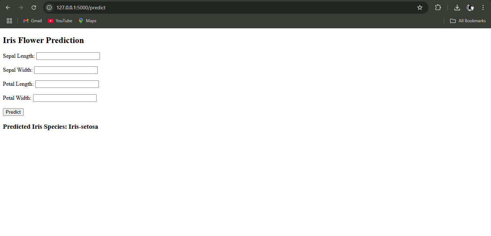
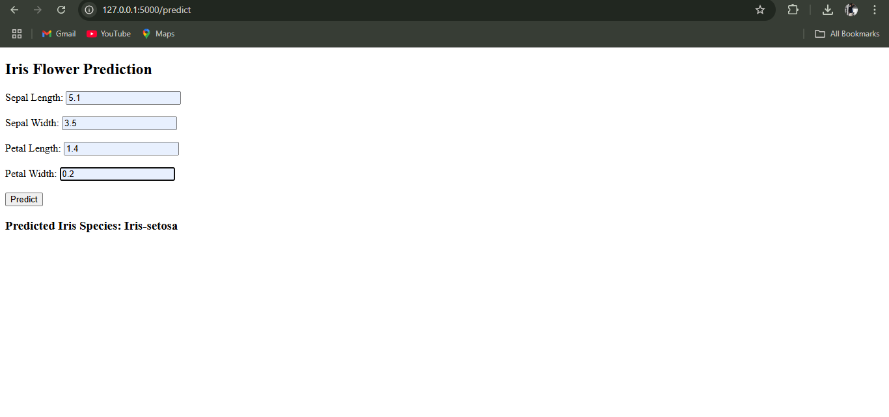
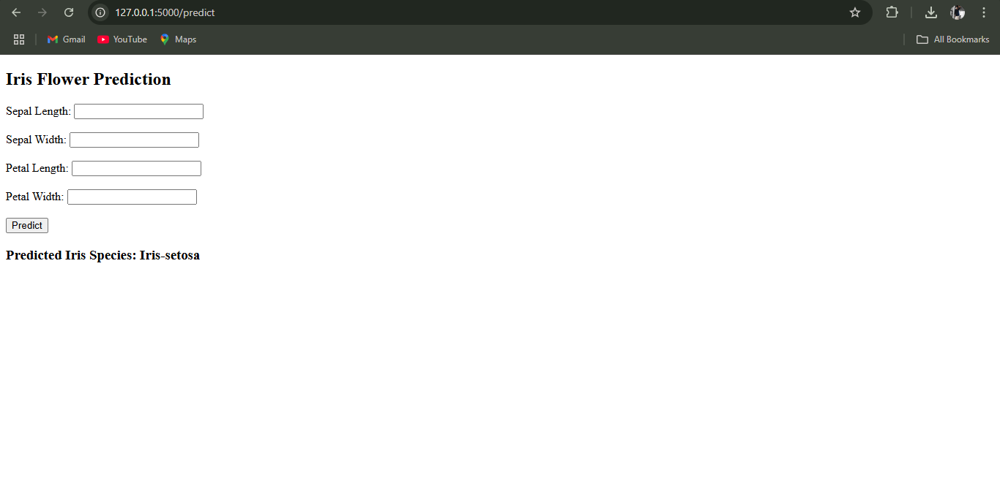

# Iris Flask ML App
This is a Flask web application that predicts the Iris flower species using a Machine Learning model trained on the Iris dataset.

---

## Features
- Input Sepal & Petal dimensions
- Predict Iris species (Setosa, Versicolor, Virginica)
- Built with Python, Flask, and scikit-learn
---
## Prerequisites

Make sure the following are installed:

- Python 3.8 or higher
- pip (Python package manager)
- Frontend: HTML with Jinja2 templates
- Backend: Flask (Python Web Framework)
- Modeling: scikit-learn (Random Forest Classifier)
- Data Handling: pandas and numpy
- Deployment: Render (Cloud Hosting with Gunicorn)

---
## Installation

### 1. Clone the repository

```
git clone https://github.com/chandru0777/Iris-Flower-Prediction.git
cd Iris-Flower-Prediction

```

### 2. Install dependencies

```
python -m venv venv
source venv/Scripts/activate         

```

---

## Running the Application

Start the Flask development server:

```
python app.py
```

Then open your browser and go to:

```
http://127.0.0.1:5000

```

---

  ## How It Works

- User submits Sepal Length, Sepal Width, Petal Length, and Petal Width through a simple web form on the homepage.
- The Flask backend receives the input and converts it into a numerical format suitable for the machine learning model.
- A pre-trained Random Forest Classifier model (iris_model.pkl) is loaded using joblib to predict the Iris flower species.
- Based on the input features, the model predicts the species as Iris-setosa, Iris-versicolor, or Iris-virginica.
- The prediction result is sent back and displayed to the user on the webpage in a clean and simple message.

---

## Project Structure
```
iris_flask_app/
├── app.py
├── train_model.py
├── Iris.csv
├── templates/
│   └── index.html
├── requirements.txt
└── README.md

```
---
## Step-by-Step Guide: How to Use the Movie Interest Predictor


### Step 1: Input Form
  

### Step 2: Filled Form 
  

### Step 3: Prediction Result


---

## Live Demo

[Click here to view the deployed app](https://placement-predictor-app-r0ho.onrender.com/)

---

